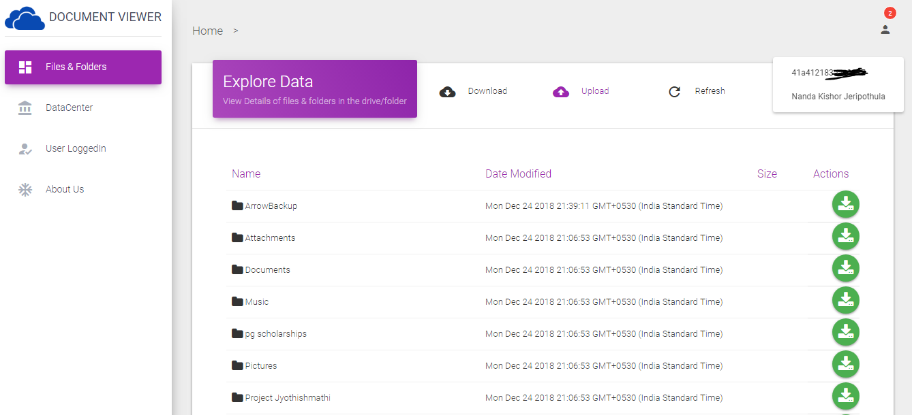

## Document Viewer Built on NodeJS

### Contents
* [Overview of the Application](#Overview)
* [Technologies Frameworks Used](#Technologies-and-Frameworks-Used)
* [GUI Details](#GUI-Details)
* [API Details](#API-Details)
* [Local Setup](#Local-Setup)
### Overview
#### This is a web based file broswer client to navigate download and upload the files
> The Key Features of the Application
* User can navigate throughout the drive / folder with UI like ususal file managers and view the metadata, ( size, dateModified, etc.,)
* Allows the User to download the contents into the local system with UI.
* User can view the profile(Name and ID) of the owner of the folder that the system rendering. 
* Entire Application is fully responsive all kinds of devices (tested).
> And it offers the following APIs
* Provides API to get files and folders in a folder( or a specific locaiton)
* Provides API to download the content, i.e, 
    1. If the downloading item is a folder then it suggests to redirect to the actual service provider for full download.
    2. If the downloading item is a file then it will generate a unique link to directly download the file into the local system.
* All these APIs are testable with API testers like POSTMan client.

>This entire application is developed under 36Hours( 1 and Half Day ) which limited the implementation of the Upload only to the API level, if more time is allocated, will implement that feature as well.

### Technologies and Frameworks Used
* NodeJS
* Express Framework
* JavaScript ( Most of the app UI is dynamically generated JavaScript)
* HTML5 
* Request Package to handle GET & POST requests.

### GUI Details
#### This Gif is a live demo of the application
>The App View

>Please find the other screenshots in the screenshots directory.

### API Details
These are for understanding purpose only, please check the implementation for deeper knowledge. (config/apis.js)
>If no other service is running then ```localhost:80``` will be presented as ```localhost``` which will be used down.
#### UserInfo API
Request URL 
```
http://localhost/api/userinfo
```
Response 
```
{
  "id": "string",
  "name": "string"
}
```
#### API to view the Contents of Folder with ID xxxxxxxxxxxxxxxxxxxx
Request URL 
```
http://localhost/api/contents

```
```
http://localhost/api/contentsof/:id

```
Here Id is the identification details ( key ) of accessing folder/directory
Response 
```
[
  {
    "path": "string",
    "tags": [
      "string"
    ],
    "createdDate": "string",
    "size": 0,
    "modifiedDate": "string",
    "name": "string",
    "id": "string",
    "directory": true
  }
]
```
#### API to Generate Download LInks
Request URL 
```
http://localhost/api/download/:id
```
Again Id is the key of the file.

Response 
```
{
  "cloudElementsLink": "xxxxxxxxxxxxxxxxxxxxxxxxxxxxxxxxx",
  "providerViewLink": "xxxxxxxxxxxxxxxxxxxxxxxxxxxxxxxxx",
  "providerLink":"xxxxxxxxxxxxxxxxxxxxxxxxxxxxxxxxxxxxxxxx"
}
```

#### API to Upload the files
Request URL 
``` javascript
//for the timebeing the file is addressed statically in the code
http://localhost/api/upload/
```
``` javascript
//This would be the actual API
http://localhost/api/upload/:uploadPath/:absolutePath/:uploadingName/:actualName

```

Response 
```
{
  "path": "/ArrowBackup/logo.png",
  "createdDate": 1545655710140,
  "size": 6227,
  "parentFolderId": "41A412183AAC9177!386",
  "modifiedDate": 1545655710140,
  "name": "logo.png",
  "id": "41A412183AAC9177!1233",
  "directory": false,
  "properties": {
    "mimeType": "image/png"
  }
}
```

### Local Setup
To run the system locally, please follow the commands
>This is excluded with the API authentication details of the cloud services provider implemented for security reason. Please reachout to ```j.kishor.bd@gmail.com``` get more information 
* Clone the Repo
```
git clone git@github.com:NandaKishorJeripothula/DocumentViewer.git
```
* run the following commands inside the repo 
```
npm install
node server
```
* navigate to following address in browser

```
http://localhost:80
```
> Made in :heart: with NodeJS